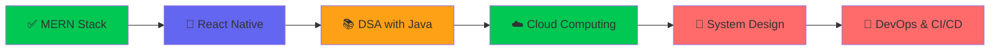

<div align="center">
  
  <!-- Animated Header -->
  

  <!-- Typing Animation -->
  <a href="https://git.io/typing-svg">
    
  </a>

  <br/>
  
  <!-- Profile Views & Followers -->
  
  <a href="https://github.com/Avinashsharma01?tab=followers">
    
  </a>
  
</div>

<br/>

<!-- Connect Section -->
<div align="center">
  <a href="https://www.linkedin.com/in/avinash-sharma-1a4251244/" target="_blank">
    
  </a>
  <a href="mailto:Avinashsharma31384@gmail.com">
    
  </a>
  <a href="https://x.com/Avinas01101000" target="_blank">
    
  </a>
  <a href="https://discord.gg/HgvJBf4B" target="_blank">
    
  </a>
  <a href="https://leetcode.com/u/Avinash_Sharma0000/" target="_blank">
    
  </a>
  <a href="https://www.instagram.com/avinash_sharma01010/" target="_blank">
    
  </a>
</div>

<br/>

<div align="center">
  
  ### 💡 "Building digital solutions that make a difference, one line of code at a time."
  
  
  
  
  
</div>

<br/>

---

##  About Me


```typescript
class AvinashSharma {
  readonly location = "Meerut, UP, India 🇮🇳";
  readonly education = "B.Tech IT @ Subharti University '26";
  
  currentRole = "React Native Intern @ EpiCircle";
  previousRole = "Software Dev Intern @ Ideovent Tech";
  
  mass = {
    mass: "Mern",
    projects: ["Institute ERP", "Course Platform", "Notes Manager"],
    certifications: ["NPTEL Java", "NPTEL DSA", "NPTEL Cloud"],
    leetcode: "135+ problems solved 🧠"
  };
  
  currentlyBuilding = "Trash to Treasure ♻️ - React Native App";
}
```

<br/>

- 🏢 **Currently:** React Native Developer Intern at **EpiCircle** — building the "Trash to Treasure" app for circular economy
- ⚡ **Stack:** React Native, Node.js, Express, PostgreSQL, MongoDB, AWS, Git
- 🎓 **Education:** Final year **B.Tech in Information Technology** at Swami Vivekanand Subharti University
- 🏆 **Previously:** Led a team of interns at **Ideovent Technologies**, shipped 2 production-ready full-stack apps
- 🛠️ **Built:** Institute ERP System handling **Fee Management, Attendance & RBAC** for 3 user roles ([Demo](#))
- 📜 **Certified:** NPTEL certifications in **Java, DSA & Cloud Computing**
- 💡 **LeetCode:** Solved [**135+ DSA problems**](https://leetcode.com/u/Avinash_Sharma0000) — Arrays, Hash Tables, Binary Search, Sorting
- 📫 **Contact:** **avinashsharma31384@gmail.com** | **+91 6201693634**

<br clear="both"/>

---

## 🛠️ Tech Stack & Tools

<div align="center">

### 👨‍💻 Programming Languages


---

### 🎨 Frontend Technologies


---

### ⚙️ Backend & Database


---

### 📱 Mobile & DevOps Tools


</div>

---

## 🎯 Current Learning Journey

<div align="center">



**Current Focus:** `React Native` • `DSA Problem Solving` • `Cloud Architecture` • `System Design Patterns`

</div>

---

## 📊 GitHub Analytics

<div align="center">
   
  
</div>

<br/>

<div align="center">
  
</div>

<br/>

<div align="center">
  
</div>

---

## 📈 Contribution Graph

<div align="center">
  
</div>

---

## 💼 Experience Timeline

```
📅 July 2025 - Present    →  🟢 EpiCircle | React Native Developer Intern (Remote)
                              └── Building "Trash to Treasure" app, implementing scrap collection features
                              
📅 June 2025 - Sep 2025   →  🔵 Ideovent Technologies | Software Developer Intern (Remote)  
                              └── Led team of interns, shipped 2 production-ready full-stack apps
                              └── Built responsive React/Tailwind frontends + Node.js/Express backends
```

**🏆 Quick Stats:** `135+ LeetCode Problems` • `4+ Production Projects` • `2 Internships` • `3 NPTEL Certifications`

---

## 🤝 Let's Connect!

<div align="center">

### 💼 Open to Full-Time Opportunities (Graduating 2026)

<p>
  <i>I'm a final-year B.Tech student actively seeking <b>Full-Stack</b> or <b>React Native Developer</b> roles.</i>
  <br/>
  <i>If you're building something impactful — let's connect! 🚀</i>
</p>

| 📧 Email | 📱 Phone | 📍 Location |
|:--------:|:--------:|:-----------:|
| [avinashsharma31384@gmail.com](mailto:avinashsharma31384@gmail.com) | +91 6201693634 | Meerut, UP, India |
  
<a href="mailto:Avinashsharma31384@gmail.com">
  
</a>
<a href="https://www.linkedin.com/in/avinash-sharma-1a4251244/">
  
</a>

</div>

<br/>

---

<!-- <div align="center">
  
  ### 💭 Random Dev Quote
  
  
  
</div> -->

<br/>

<!-- Snake Animation -->
<div align="center">
  <picture>
    <source media="(prefers-color-scheme: dark)" srcset="https://raw.githubusercontent.com/platane/snk/output/github-contribution-grid-snake-dark.svg">
    <source media="(prefers-color-scheme: light)" srcset="https://raw.githubusercontent.com/platane/snk/output/github-contribution-grid-snake.svg">
    
  </picture>
</div>

<br/>

---

<div align="center">
  
### ⭐ If you find my work interesting, consider giving my repos a star!
  
<p>
  
  
  
</p>


**⚡ Built with passion by Avinash Sharma | Last Updated: January 2026**

</div>


